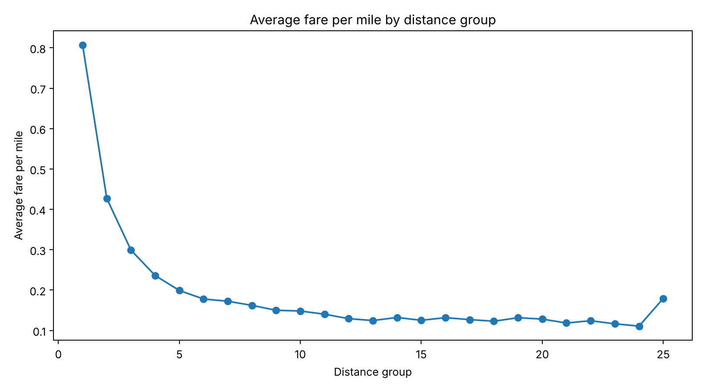
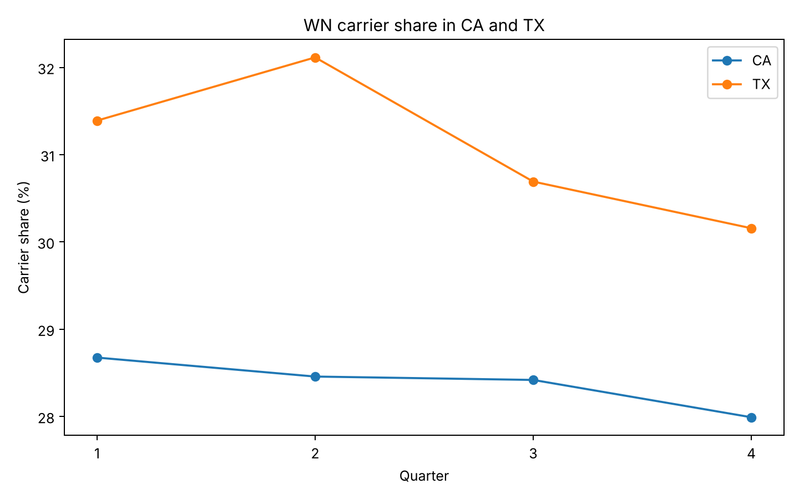

# DB1B Airline Analysis

SQL and Python analysis of U.S. airline fares, using the 2024 DB1B Airline Origin and Destination Survey from the Bureau of Transportation Statistics (BTS).

It covers fares, distance, carriers, trip type and origin state, plus the joins between the Ticket, Market and Coupon tables.

## Data

- Period: 2024 Q1-Q4
- Tables:
  - DB1BTicket: one row per itinerary
  - DB1BMarket: one row per market
  - DB1BCoupon: one row per coupon (flight segment)
- Tools: PostgreSQL, pgAdmin, Python, Pandas, Matplotlib, Git, GitHub

The raw DB1B files are too large for GitHub. The repo only has small sample rows in `data/samples/` and the aggregated results in `outputs/`.

## Repository structure

```text
DB1B-Airline-Analysis/
├── data/
│   ├── DATA_DICTIONARY.md
│   └── samples/
├── sql/
│   ├── 01_schema.sql
│   ├── 02_data_understanding.sql
│   ├── 03_data_validation.sql
│   ├── 04_baseline_analysis.sql
│   ├── 05_exploratory_analysis.sql
│   ├── 06_diagnostic_analysis.sql
│   └── 07_join_analysis.sql
├── notebooks/
│   └── Python_EDA_Visualization.ipynb
├── outputs/
├── images/
└── README.md
```

The SQL files are meant to be read in order: load the data, check it, then go from overall numbers to more specific questions. The notebook comes last and only draws charts from the SQL results.

## Main findings
   
   
- DB1BTicket has 20,066,076 itineraries for 2024.
- Q2 has the most itineraries. Q4 has the highest average fare, about 456.59.
- WN has the most itineraries of any carrier.
- Round trips are more common than one-way and have a higher average fare and distance, but a slightly lower fare per mile.
- About 52.8% of itineraries have two coupons.
- Average fare generally goes up with distance group, while fare per mile generally goes down.
- AK has the highest average fare among origin states with at least 50,000 itineraries.
- WN is the largest carrier in both CA and TX in all four quarters.
- On round-trip itineraries, HA has the longest average segment distance.

## Table relationships

```text
DB1BTicket   1 row = 1 itinerary
    |
    |  one to many, on itin_id
    v
DB1BMarket   1 row = 1 market
    |
    |  one to many, on mkt_id
    v
DB1BCoupon   1 row = 1 coupon / segment
```

Joining Ticket to Market repeats `itin_fare` once per market, so summing it after the join overstates the total. `sql/07_join_analysis.sql` shows this and aggregates back to one row per itinerary first.

## Charts

- average fare by quarter
- average fare by distance group
- fare per mile by distance group
- top carriers by itinerary count
- one-way vs round-trip
- itineraries by number of coupons
- WN share in CA and TX
- round-trip segment distance by carrier


## Data source

U.S. Department of Transportation  
Bureau of Transportation Statistics  
Airline Origin and Destination Survey (DB1B)
